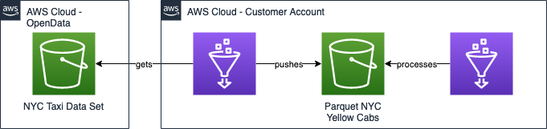

# AWS Glue Workflow & CICD
> An end-to-end demo for generating glue workflows through IaC and integrating them with a CICD chain.

Lead Maintainer: [Jean-Robin Foehn](mailto:fjeanrob@amazon.com)

## 📋 Table of content

 - [Installation](#-install)
 - [Metrics](#-metrics)
 - [Pre-requisites](#-pre-requisites)
 - [Description](#-description)
 - [Usage](#-usage)
 - [See also](#-see-also)

## 🚀 Install

### 1. Fork this repository
To get started, fork this repository and export the following Github envvars:
```shell
export GITHUB_OWNER=<your github username>
export GITHUB_REPO=<your github repository name>
export GITHUB_BRANCH=main #unless you have another one
```

### 2. Generate a Personal Access Token on Github
Go to your ```Settings > Developer Settings``` and generate a new personal access token. Make sure it has the following rights:  

- repo
  
  - repo:status
    
  - repo_deployment
    
  - public_repo
    
  - repo:invite
    
  - security_events  
  
- admin:repo_hook
    
  - write:repo_hook
    
  - read:repo_hook
    
Add this token to AWS Secrets Manager as **plaintext** and not as *key/value*. You can use the following command with the AWS CLI  
```shell
aws secretsmanager create-secret --name github-token --secret-string <Replace With Your Token Value>
```
### 3. Deploy with CDK
```shell
python3 -m venv .venv
source .venv/bin/activate
pip3 install -r requirements.txt
```
```shell
cdk deploy --all
```

## 📊 Metrics

The below metrics displays approximate values associated with deploying and using this block.

Metric | Deployment | Workflow Run | Original Dataset | Transformed Dataset
------ | ------ | ------ | ------ | ------ |
 **Time** | 3 minutes | 25 minutes
 **Volume** | NA | NA | ~230GB | ~50 GB 

## 🎒 Pre-requisites

- CDK (test on v1.91)
- Python 3.8

## 🔰 Description

The goal of this demo is to showcase customers how you can integrate a CICD chain with their AWS Glue ETL Scripts in order to automatically update their AWS Glue Workflows.  
In addition, we will show how we can easily create an AWS Glue Workflow 'as code'.



## 🛠 Usage 

CDK doesn't support Trigger Activation as of 2021-03-15. Make sure you activate the AWS Glue Triggers before launching the workdlow.

### 🏃 Running the demo 

Follow the instructions above.
Launch workflow from AWS Console or CLI: 

```shell
aws glue start-workflow-run --name nyc_workflow
```

## ⚠️ Warnings (optional)

- AWS Glue service role has AmazonS3FullAccess Policy

## ⚙️ Contributing / Next Steps  
- [ ] create lambda custom resource to activate triggers on stack creation
- [ ] better parquet_processing.py script ? Add actual transforms insteand of prints

## 👀 See also

List here any resources that helps the audience to understand how the demo works

 - [AWS Glue](https://docs.aws.amazon.com/glue/) official documentation
 - [NYC TLC Dataset](https://registry.opendata.aws/nyc-tlc-trip-records-pds/)